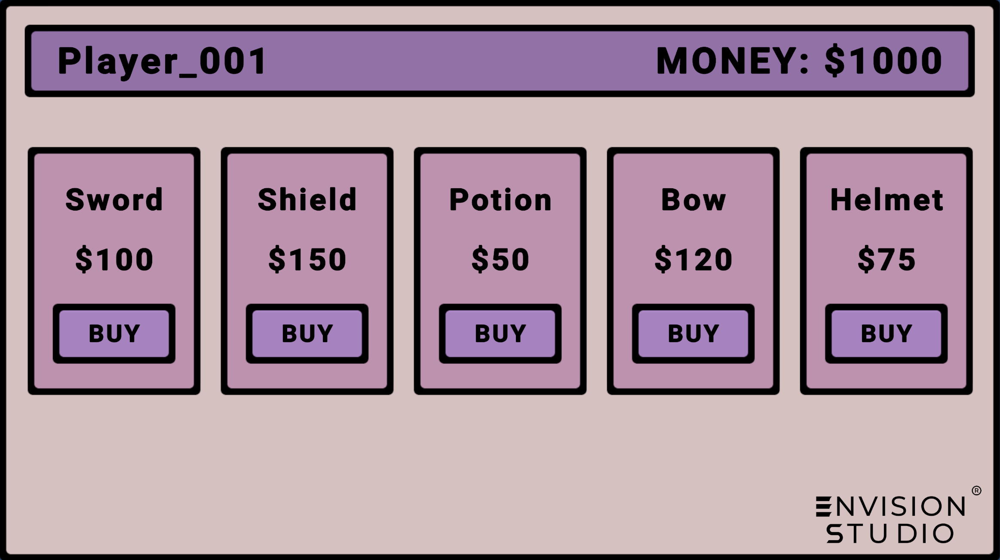

# Repository Pattern Example Project  

This project demonstrates the implementation of the **Repository Pattern** and **Unit of Work Pattern** in Unity. It is designed as a shop system, showcasing how these patterns can simplify data handling, improve code organization, and maintain consistency.  



## Features  

### Shop System  
- Displays a list of purchasable items with names, prices, and purchase buttons.  
- Dynamically updates the player's money after each purchase.  
- Prevents purchases when funds are insufficient.  

### Repository Pattern  
- Encapsulates data access to maintain separation of concerns.  
- Handles loading and saving item data from a JSON file.  
- Makes the system modular and testable.  

### Unit of Work Pattern  
- Ensures consistency by coordinating transactions across repositories.  
- Guarantees updates to the player’s inventory and wallet occur together.  

### JSON Data Storage  
- Item details are stored in an easy-to-modify JSON file (`ItemsData.json`).  

## Technologies Used  
- **Unity Engine** (6000.0.25f1)  
- **C# Scripting**  
- **JSON** for data storage  
- **TextMeshPro** for polished UI elements  

## Project Structure  
```
Unity  
├── Assets  
│   ├── Data  
│   │   └── ItemsData.json         # JSON file containing item details  
│   ├── Prefabs                   # Unity prefabricated assets  
│   ├── Scenes                    # Unity scenes  
│   ├── Scripts  
│   │   ├── Repository Pattern    # Core repository pattern implementation  
│   │   │   ├── DataContext.cs  
│   │   │   ├── GameData.cs  
│   │   │   ├── Item.cs  
│   │   │   ├── Items.cs  
│   │   │   ├── Player.cs  
│   │   │   ├── Repository.cs  
│   │   │   └── PopulateShop.cs  
│   └── TextMesh Pro              # Fonts and UI text assets  
├── Packages                      # Unity package manager dependencies  
```

## Scripts Overview  

### `Item.cs`  
Defines the structure for an item, including its ID, name, and price.  

### `Player.cs`  
Represents the player, including their name, available money, and inventory.  

### `GameData.cs`  
Stores a list of items in a container that can be loaded or saved as JSON.  

### `DataContext.cs`  
An abstract class for managing game data, defining methods for loading and saving data.  

### `JsonDataContext.cs`  
Handles data persistence by reading and writing to a JSON file.  

### `Repository.cs`  
Provides methods to interact with game data, such as retrieving, adding, deleting, and saving items.  

### `PopulateShop.cs`  
Manages the shop UI, displaying items, handling purchases, and updating the player's money.  

### `Items.cs`  
A subclass of `Repository` to represent a collection of items.  

## How to Use  

1. Clone the repository:  
   ```bash
   git clone https://github.com/MCLakshan/Repository-Pattern-Example-EnvisionStudio-Blog.git
   ```
2. Open the project in Unity (tested with **6000.0.25f1**).  
3. Ensure the JSON file `ItemsData.json` is located in the `Assets/Data` folder.  
4. Run the scene to interact with the shop system.  

## JSON File Example  

The `ItemsData.json` file contains all shop items:  

```json
{
    "Items": [
        { "ID": 1, "Name": "Sword", "Price": 100.0 },
        { "ID": 2, "Name": "Shield", "Price": 150.0 },
        { "ID": 3, "Name": "Potion", "Price": 50.0 },
        { "ID": 4, "Name": "Bow", "Price": 120.0 },
        { "ID": 5, "Name": "Helmet", "Price": 75.0 }
    ]
}
```
## Contribution  

Feel free to fork the repository and submit pull requests to improve the project or add new features.  

## License  

This project is open-source and available under the MIT License.  
